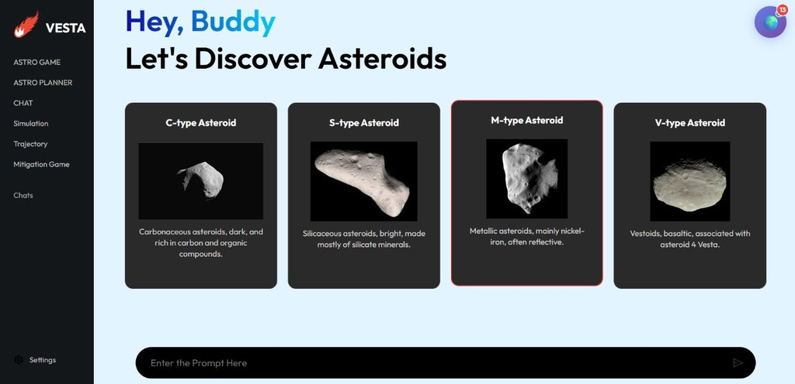

# Vesta: Planetary Defense & Cosmic Exploration Platform

Vesta is a comprehensive interactive platform designed to educate and engage users about our solar system, near-earth objects (NEOs), and planetary defense. Combining immersive 3D simulations, real-time data, and AI-powered assistance, Vesta offers a unique way to explore the cosmos and understand the science of asteroid impacts and mitigation.

## 🚀 Key Features

### ☄️ Asteroid Impact Simulator
Experience the potential consequences of celestial impacts. Our advanced calculator allows you to launch virtual asteroids, visualize their trajectories, and understand the scale of impact events using real-world physics and data.


### 🌌 Immersive 3D Solar System
Explore the universe like never before. Vesta leverages **Three.js** to render stunning, interactive 3D models of the solar system, planets, and asteroids directly in your browser.


### 🤖 AI-Powered Cosmic Guide
Have questions about space? Our integrated AI assistant, powered by **Google Gemini**, is here to help. Whether you need details about specific asteroids or explanations of complex astronomical phenomena, your personal guide is just a chat away.



### 👓 AR/VR & Interactive Tools
Take exploration to the next level with Augmented and Virtual Reality features. Bring celestial objects into your living room or immerse yourself in a virtual space environment.
*   **Mitigation Games:** Test your skills in saving the planet with interactive strategy games.
*   **Trajectory Predictions:** Visualize the paths of Near-Earth Objects.


---

## 🛠️ Tech Stack

Vesta is a modern monorepo featuring two main applications:

### **Backend & Core App (Next.js)**
Located in `Backend(Metor Impact)/`
*   **Framework:** Next.js 15 (App Router)
*   **Language:** TypeScript
*   **UI/Styling:** Tailwind CSS, Framer Motion, Radix UI
*   **Database:** Drizzle ORM
*   **3D/Maps:** React Three Fiber, Leaflet
*   **Auth:** Better Auth

### **Frontend & Visualizations (Vite)**
Located in `Frontend/`
*   **Framework:** React + Vite
*   **AI:** Google Generative AI SDK
*   **3D/Maps:** Three.js, React Leaflet
*   **Routing:** React Router DOM

---

## 🏁 Getting Started

To run Vesta locally, you will need to set up both the backend and frontend services.

### Prerequisites
*   Node.js (v18+ recommended)
*   npm or yarn

### 1. Setup Backend (Meteor Impact)
This application handles the core simulations and main user interface.

```bash
cd "Backend(Metor Impact)"
npm install
npm run dev
# Server usually starts at http://localhost:3000
```

### 2. Setup Frontend (Visualizations)
This application hosts specific visualization tools and games.

```bash
cd Frontend
npm install
npm run dev
# Server usually starts at http://localhost:5173
```

## 📂 Project Structure

*   `Backend(Metor Impact)/` - Main Next.js application containing the impact calculator, dashboard, and API integrations.
*   `Frontend/` - Vite-based React application hosting the 3D visualizer, minigames, and AI chat interface.
*   `images/` - Project assets and screenshots.

## 📄 License

This project is open-source and available for educational and non-commercial use.
